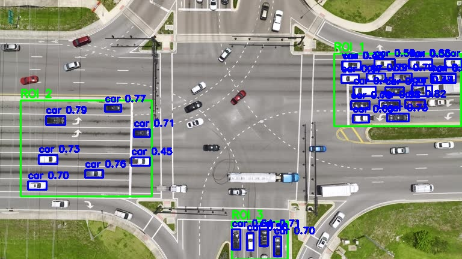

# Smart Traffic Signal Routing

## Overview

As cities become increasingly populated, efficient traffic management becomes crucial. Our Smart Traffic Signal Routing project proposes a unique algorithm that analyzes aerial imagery to optimize traffic signal timing and scheduling. This project aims to reduce wait times at intersections, improve traffic flow, and contribute to more sustainable urban environments.

## 🎯 Objectives

- Develop an AI-powered system to analyze real-time traffic conditions from aerial images
- Create an algorithm to dynamically adjust traffic signal timings based on vehicle density and type
- Reduce overall wait times at intersections and improve traffic flow
- Contribute to Sustainable Development Goal 11: Sustainable Cities and Communities

## 🛠 Technologies Used

- **Dataset**: VisDrone
- **Object Detection**: YOLOv8
- **Custom Code**: For ROI (Region of Interest) extraction and inferencing

## 🧠 How It Works

1. **Aerial Image Analysis**: The system takes in aerial images of intersections.
2. **Object Detection**: YOLOv8 is used to detect and classify vehicles in the image.
3. **ROI Extraction**: Custom code extracts relevant regions of interest from the processed image.
4. **Traffic Density Calculation**: The algorithm computes the number and types of vehicles at each signal.
5. **Priority Assignment**: Each signal is assigned a priority based on a weighted sum of vehicle types.
6. **Time Delay Calculation**: The system calculates optimal time delays for each signal based on traffic density.
7. **Signal Scheduling**: An efficient schedule is created for all signals at the intersection.

## 🌱 Sustainability Impact

This project directly contributes to UN Sustainable Development Goal 11: Sustainable Cities and Communities. By optimizing traffic flow, we aim to:

- Reduce vehicle emissions from idling at traffic signals
- Improve air quality in urban areas
- Enhance the overall efficiency of urban transportation systems
- Contribute to the development of smart, sustainable cities
